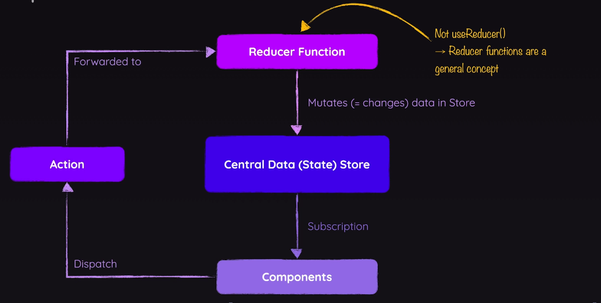

# Redux
A third party library for managing application state. It is an alternative to using React Context API for managing cross-component state or app-wide state.

## Types of State Management
- Local state: State that is managed within a component. (e.g., using `useState` in React)
- Cross-component state: State that is managed across multiple components.
- App-wide state: State that is managed across the entire application.

## Downsides of a React Context API
- Using React Context lead to using tough set-up where there will be a lot of contexts that depend on each other.
  Which is both hard to manage and hard to debug.
- The performance of React Context is not as good. Especially when the state is updated frequently.
  Because when a context value changes, all components that consume that context will re-render.

## How Redux Works?
- Redux uses a single store to manage the state of the entire application.
- The state in the store is immutable, meaning it cannot be changed directly.
- Components that depend on the state are using subscribers to listen for changes in the store. (They get a slice of the state in store)
- Components cannot change the state directly. Instead, they dispatch actions (JavaScript objects) to the store.
- The store uses reducers (pure functions) to determine how the state should change based on the action dispatched.


## Writing Redux Code
- Writing a redux code does not require React. It can be used with any JavaScript or even in Node.js.
- We never mutate the state directly. Instead, we return a new state object from the reducer.
- Below is a simplest redux code that demonstrates the core concepts of Redux. Shown on the diagram above.
```js
const redux = require("redux");

const ACTION = {
  INCREMENT: "increment",
  DECREMENT: "decrement",
};

const incrementAction = { type: ACTION.INCREMENT };
const decrementAction = { type: ACTION.DECREMENT };

// returns new state based on state and action.
// reducer is a pure function which means it always returns the same output for the same input and has no side effects.
const counterReducer = (state, action) => {
  switch (action.type) {
    case ACTION.INCREMENT:
      return {
        counter: state.counter + 1,
      };
    case ACTION.DECREMENT:
      return {
        counter: state.counter - 1,
      };
    default:
      return state;
  }
};

// create a store with the reducer and initial state
const store = redux.createStore(counterReducer, { counter: 0 });

// a subscriber function that gets called whenever the state changes
const counterSubscriber = () => {
  const latestState = store.getState();
  console.log(latestState);
};

// subscribe to changes in the store
store.subscribe(counterSubscriber);

// dispatch an action to change the state
store.dispatch(incrementAction);
```

## React-Redux
- react-redux is the official React binding for Redux. It provides a way to connect React components to the Redux store.
- It provides two main hooks: `useSelector` and `useDispatch`.
  - `useSelector`: A hook that allows you to extract data from the Redux store state, using a selector function.
  - `useDispatch`: A hook that gives you access to the dispatch function, which you can use to dispatch actions to the Redux store.
- The `Provider` component from react-redux is used to wrap the root component of your application.
  It makes the Redux store available to any nested components that need to access the Redux store.
- When using `useSelector`, the component will automatically re-render whenever the selected state changes.
```jsx
// Provide the store to the React application
import { Provider } from 'react-redux';

const root = ReactDOM.createRoot(document.getElementById('root'));
root.render(
  <Provider store={store}>
    <App />
  </Provider>
);
```

```jsx
const Counter = () => {
  const { counter, showCounter } = useSelector((state) => state);
  const dispatch = useDispatch();
  return (
    <main className={classes.counter}>
      {showCounter && <div className={classes.value}>{counter}</div>}
      <div>
        <button onClick={() => dispatch(ACTIONS.INC)}>Increment</button>
        <button onClick={() => dispatch({ ...ACTIONS.CHANGE, payload: value })}>Change by value</button>
        <button onClick={() => dispatch(ACTIONS.DEC)}>Decrement</button>
      </div>
      <button onClick={toggleCounterHandler}>Toggle Counter</button>
    </main>
  );
}
```

## Redux Toolkit
- Redux toolkit solves a lot of problems that plain Redux has.
  - It simplifies the store setup process.
  - It allows to write a mutable update logic in reducers. But it is not actually mutating the state.
    Instead, it uses Immer library under the hood to handle immutability.
  - It provides a way to write reducers that can mutate the state directly, using Immer library under the hood.
  - It includes useful utilities for common Redux tasks, such as creating actions and reducers.
- It is the recommended way to write Redux logic in modern applications.

````bash
npm i @reduxjs/toolkit react-redux
````

## Redux and side effects
- Reducer functions must be pure functions. They should not have side effects, be asynchronous, or mutate the state directly.
- For the same input, a pure function always returns the same output.
### How to handle side effects in Redux?
- We can either use the useEffect hook in React components to handle side effects. Then redux won't be aware of the side effects.
- Or we can use middleware libraries like redux-thunk or redux-saga to handle side effects

### Redux Thunk
- Thunk is an action creator that returns a function instead of an action object.
- this function returns a promise that resolves to an action object.
```js
export const sendCartData = (cart) => {
  return async (dispatch) => {
    showNotification(dispatch, {
      status: 'pending',
      title: 'Sending...',
      message: 'Sending cart data!',
    });
    try {
      await sendCartDataToAPI(cart);
      dispatch(cartActions.resetChanged());
      showNotification(dispatch, {
        status: 'success',
        title: 'Success!',
        message: 'Sent cart data successfully!',
      });
    } catch (error) {
      showNotification(dispatch, {
        status: 'error',
        title: 'Error!',
        message: 'Sending cart data failed!',
      });
      dispatch(cartActions.resetChanged());
    }
  }
};
```
