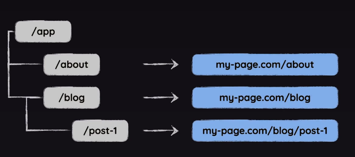
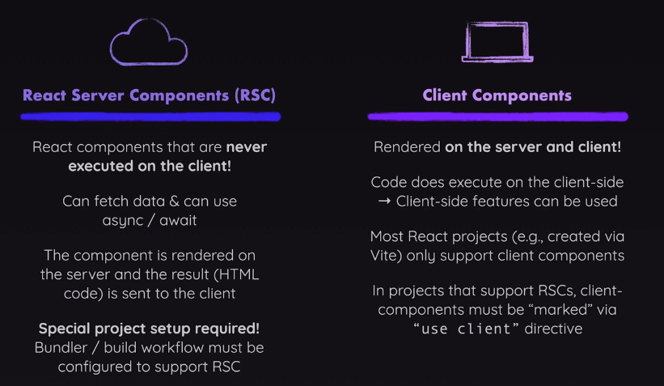

# Next.js
Next.js is a React framework that allows developers to build full-stack applications.

## Creating a Next.js App
docs: https://nextjs.org/docs/app/getting-started/installation

```bash
npx create-next-app@latest <project-name>
```

## Next.js file structure
- docs: https://nextjs.org/docs/app/getting-started/project-structure#colocation
- For routing next uses the file system
- the main folder is /app
  - the routes are created out of the folders inside the /app

- there are some special file names

### page.js
Tells next to render this component under a given route.
for example when we will add route /about/page.jsx
```jsx
// This will render under /about
export default function AboutPage() {
  return (
    <main>
      <h1>About Page</h1>
      <p>This is the about page of our application.</p>
    </main>
  )
}

```
### layout.js
it wrapps the page
- in root layout we use html and body elements
- we do not add head, instead we add metadata, which will work as head. The name is reserved
- each next project needs a root layout
- each route can have it's own layout, but it is not required

```jsx
import './globals.css'

export const metadata = {
  title: 'NextJS Course App',
  description: 'Your first NextJS app!',
};

export default function RootLayout({ children }) {
  return (
    <html lang="en">
      <body>{children}</body>
    </html>
  );
}
```

### icon.{png, jpg, etc}
This file will be used as a favicon (the small one in the navbar)

### not-found.js
Fallback page for "Not Found" errors (thrown by sibling or nested pages or layouts)
```jsx
export default function NotFound() {
  return (
    <main className="not-found">
      <h1>Not found</h1>
      <p>Unfortunately, we could not find the requested page or resource.</p>
    </main>
  );
}

```
- We can also call the not found function provided by next. And it will render the nearest not-found component
```jsx
export default async function MealsDetailPage({ params }) {
  const { slug: mealSlug } = await params;
  const meal = await getMealBySlug(mealSlug);

  if (!meal) {
    notFound();
  }
}
```

### error.js
Must be a client component, because it need to catch both server and client side errors
Fallback page for other errors (thrown by sibling pages or nested pages or layouts)
```jsx
'use client'

import React from 'react'
  
export default function ErrorPage({error}) {
  return  (
    <main>
      <h1>Something went wrong!</h1>
      <p>{error?.message ?? 'Unknown error occurred'}</p>
    </main>
  )
}
```

### loading.js
Fallback page which is shown whilst sibling or nested pages (or layouts) are fetching data

### route.js
Allows you to create an API route (i.e., a page which does NOT return JSX code but instead data, e.g., in the JSON format)

### More about file structure
- All routes are located in the /app folder, we can safely store other components in the app folder, and do not be scared, that they will have own routes,
  because the page.js component or route.js is needed. 
- if we want to make sure component is not routed. We can make it private by adding _name
- we can create route groups by setting () around the group name. It can help with the organization and it won;t influence the url.
- We can add a dynamic routes, by wrapping a folder name with square brackets []

````jsx
import React from 'react'

// Params is a special prop provided by Next.js for dynamic routes
// It contains the dynamic segments of the URL
// In this case, params.id will hold the value of the dynamic segment [id]
export default function BlogPostPage({ params }) {
  console.log(params.id);
  return (
    <main>
      <h1>Blog Post</h1>
    </main>
  )
}
````

## Next.js custom components
Next framework is offering us a lot of built in components. They can be helpful for a lot of reasons, like performance or other.

### Link
Instead of using <a></a> tag we can use <Link> component that allows to use SPA navigation

### Image
docs: https://nextjs.org/docs/app/api-reference/components/image
For example allows to lazy load the image by default.

```jsx
 <Image 
  src={logoImg.src}
  alt="A plate with food on it"
  width={50}
  height={50}
  fill // this property can be used when we don't know the width of the element, for example when it is a dynamic image. It will fill it's container
/>
```

## Components in Next.js
There are 2 types of React components RSC and CC
- RSC = React Server Components -> This is a default component in next.js, by default all components are server-side.
Such component is rendered on the server.
  - Pros:
    - better SEO, because web search crawler will see the ready page, whereas when using vanilla React, all html is loaded when entering the page. And it is empty at the start.
    - better performance, cause by smaller amount of client code being processed in the browser.
    - you can easily get stuff from the database and use async code inside the component function code
  - Cons/limitations:
    - Server components are not able to use most of React hooks like useState, or useEffect
    - Server components cannot handle event handlers

- CC = Client Component - A component that is rendered in the browser and it's code is executed in the browser.
  - In order to declare a client component we need to add 'use client' statement at the top
  - Because client components are worse for the performance, we should use them for as small components as possible

- CC cannot render a RSC, but RSC can render CC.
- The CC can render RSC as child. This works because the component is rendered then in a parent server component and then sent to the client.
- in next when we add RSC into CC, then next will change it to the CC under the hood.



### Fetching data in a server component
In a server component we do not need to use axios or the fetch API. We can simply get the data directly from the database.

````jsx
// db code
export async function getAllMeals() {
  const query = `
    SELECT * FROM meals
  `;
  const meals = db.prepare(query).all();
  await new Promise((resolve) => setTimeout(resolve, 2000));
  return meals;
}

async function MealsPage() {
  const meals = await getAllMeals();
  return (
    <>
      <main className={classes.main}>
        <MealsGrid meals={meals} />
      </main>
    </>
  );
}
````

## Handling forms

### Form submission
In order to submit a form data we need to set up so called 'form action'.
Which is a function that should run on the form submission. This action should 'use server'.

```js
'use server';

import { redirect } from "next/navigation";
import { createMeal } from "./meals";

// this is called a server action
// behind the scenes next.js will create an api route for us
// server action can only be used in server components
export async function shareMeal(formData) {
  const meal = {
    creator: formData.get('name'),
    creator_email: formData.get('email'),
    title: formData.get('title'),
    summary: formData.get('summary'),
    instructions: formData.get('instructions'),
    image: formData.get('meal-image'),
  }
  // here we call some function that will handle saving the data on the server
  await createMeal(meal);
  redirect('/meals');
}
```

```jsx
export default function ShareMealPage() {
  return (
    // Here we assign the server action to our form
    <form className={classes.form} action={shareMeal}>
      // some fields...
    </form>
  )
}
```

### Handling form status
React provides us with a hook that allows us to get the currently submitted form status.
The simplest example would be to check if the form is currently pending and act based on this.

```jsx
'use client';
// only available in a client components
import { useFormStatus } from 'react-dom';

export default function MealsFormSubmit() {
  const { pending } = useFormStatus();

  return (
    <button disabled={pending}>
      {pending ? 'Submitting...' : 'Share Meal'}
    </button>
  );
}
```